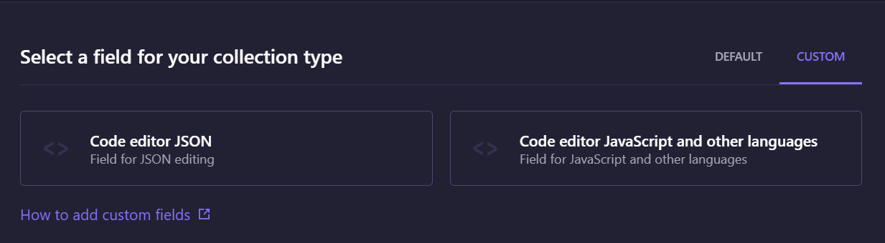
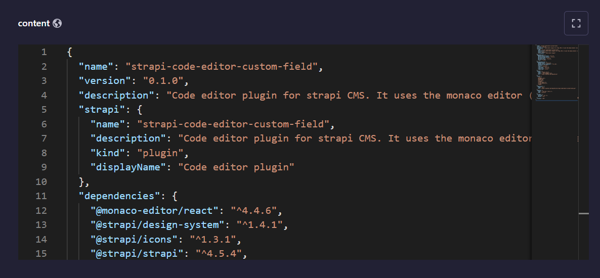
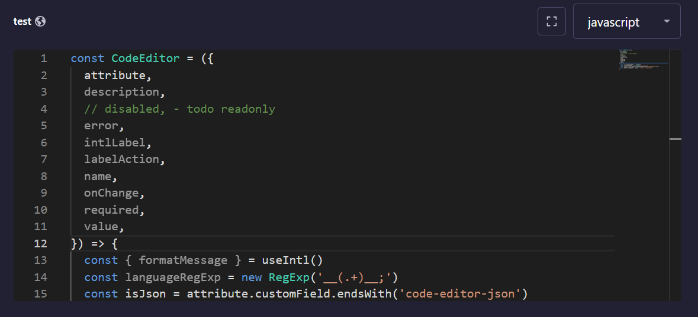
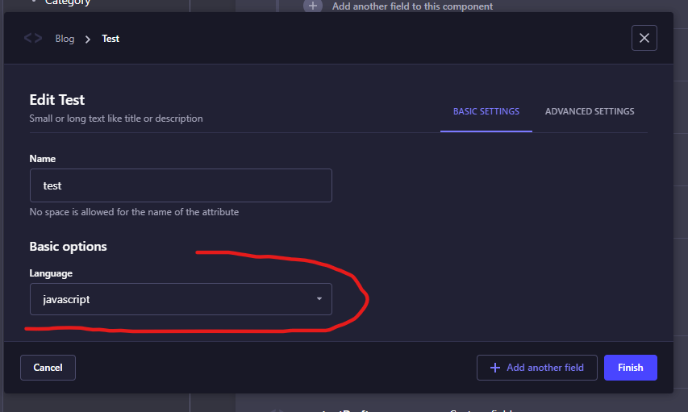

# Strapi plugin strapi-code-editor-custom-field

Code editor plugin for strapi CMS. It uses the monaco editor (vscode).

## Installation

You need install also monaco editor.

```
yarn add monaco-editor monaco-editor-webpack-plugin strapi-code-editor-custom-field
```

```
npm install monaco-editor monaco-editor-webpack-plugin strapi-code-editor-custom-field
```

You must add plugin to `config/plugins.js` file.

```
{
  ...
  'strapi-code-editor-custom-field': {
    enabled: true,
  },
  ...
}
```

You need to update the `config/middlewares.ts` file. Replace `strapi::security` with

```
{
  name: 'strapi::security',
  config: {
    contentSecurityPolicy: {
      useDefaults: true,
      directives: {
        'script-src-elem': ["'self'", 'cdn.jsdelivr.net'],
        upgradeInsecureRequests: null,
      },
    },
  },
},
```

This will add the `cdn.jsdelivr.net` to the `script-src-elem` directive for enabling content security policy.

And the last step is to add the `monaco-editor-webpack-plugin` to the `src/admin/webpack.config.js` file.

```
'use strict'

const MonacoWebpackPlugin = require('monaco-editor-webpack-plugin')

module.exports = (config) => {
  config.plugins.push(new MonacoWebpackPlugin())

  return config
}

```

Last step is to rebuild the admin panel.

```
npm run build

OR

yarn build
```

## Usage

When you add the plugin you will see two new custom fields. One for javascript (and other languages) and one for json.



The editor then will show up in content-type add/edit page. It can be opened in fullscreen mode.

### JSON editor



### Javascript editor



You can select the language in content-type builder options (if you select it, you can not change it in the editor instance).




## Under the hood

Editor is using two different types for strapi field. When you select JSON editor it will be `json` type.
When you select different language, it will be `text` type.

For `text` type you can select the language. If you select it, the select will not show up in the editor.

In case you don't select the language, you can pick it dynamically, but the language is prefixed before the value.

Language selector:

```javascript
const languageRegExp = new RegExp('__(.+)__;')
const languageFromValue = value.match(languageRegExp)[1]
```

Remove language from value:

```javascript
const languageRegExp = new RegExp('__(.+)__;')
const valueWithoutLanguage = value.replace(languageRegExp, '')
```

## Issues

If you find any issues, please report
them [here](https://github.com/TomaszPilch/strapi-code-editor-custom-field/issues).

## Development

If you want to contribute to this plugin, you can follow this steps:

1. Clone this repository
2. Install dependencies

```
yarn install
```

3. Link the plugin

```
yarn link
```

4. Link the plugin to your strapi project

```
cd /your-strapi-project
yarn link strapi-code-editor-custom-field
```

5. Build the plugin

```
yarn build
```

6. Run watch mode

```
yarn watch
```

7. Start the strapi project

## Contributing

Feel free to fork and make a Pull Request to this plugin project. All the input is warmly welcome! ❤️

More info about [contributing](https://github.com/TomaszPilch/strapi-code-editor-custom-field/blob/main/CONTRIBUTING.md).
